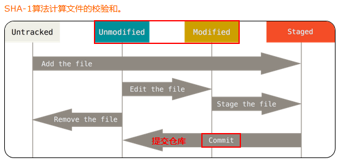

# Git、GitHub 使用说明

### 一、预备知识：

1、GitHub是一个基于git的代码托管平台。通过Github可以实现社会化编程。

2、Git：一个分布式版本控制系统。Git没有中央服务器，不需要联网，每个人的电脑就是一个完整的版本库。用户名和邮箱作为Git系统标识。Git系统标识会在提交日志中显示。

```markdown
$ git config --global user.name "your name"
$ git config --global user.email "your_email@youremail.com"
```
3、Git 能跟踪仓库每个文本文件的修改和删除具体变化。二进制文件虽能也能被版本控制系统管理，但是版本控制系统无法跟踪文件的变化。版本控制系统只能把二进制文件每次改动串起来，只能知道图片从1kb变成2kb，版本控制系统也不知道二进制文件的具体变化。

4、仓库（repository）操作：上传仓库、检出仓库

```markdown
$ git remote add origin git@github.com:yourName/yourRepo.git
 
$ git clone username@host:/path/to/repository
```
5、仓库（版本库--隐藏目录'.git'）和Git的关系：本地仓库由 Git 维护的三棵"树"组成。
第一个：工作目录，包含实际文件；
第二个：暂存区（stage或index），它像个缓存区域，临时保存用户改动；
第三个：HEAD，指向用户在该分支中最后一次提交的结果的指针。HEAD在每个分支都有。分支合并之后，用户还可以通过该分支的HEAD，在分支上开发。合并只是将master指向目前使用分支的HEAD指针指向的内容。

6、工作区+版本库（仓库.git）{暂存区（index或stage）+HEAD（指向用户在该分支中最后一次提交的结果的指针）+master}

7、SSH协议是面向互联网网络中主机之间的互访与信息交换。主机密钥成为基本的密钥机制。SSH协议要求每一个使用SSH协议的主机都必须至少有一个自己的主机密钥对，服务方通过对客户方主机密钥的认证之后，才能允许其连接请求。

8、分支：在分支上，文件每次的修改提交。Git都把分支上不同的文件版本串成一条时间线，这条时间线就是一个分支。

9、工作树：在.git目录中的内容称为“附属于该仓库的工作树”。文件的编辑等操作在工作树中进行，然后记录到仓库中，以此管理文件的历史快照。

10、工作目录下的文件的四种状态：untracked、unmodified、modified、staged。仓库中包含各个时间点的文件快照。



### 二、Git 操作命令：

1、git init：把文件目录变成git可以管理的仓库。Initialized empty Git repository in d:/www/testgit/.git/

2、`git add`：把文件添加到暂存区

3、`git commit -m`：把文件提交到仓库。git commit输入提交信息的时候，通过调用vim编辑器进行信息编写的，使用vim编辑器的命令操作。

提交信息的格式：第一行：用一行文字简述提交的内容；第二行：空行；第三行以后：记述更改的原因和详细内容

`git commit --amend`：修改提交信息

`git rebase -i HEAD-2`：压缩历史。选定当前分支中包含的HEAD（最新提交）在内的两条最新历史记录为对象，打开编辑器，在内容编辑器中将pick>>fixup。

4、`git status`：查看仓库的状态，查看文件提交队列中是否还有未提交文件，跟踪文件是否发生变化

5、`git diff`：查看工作树和暂存区的差别；git diff HEAD 查看工作树和最新提交的差别

6、`git log`：查看提交日志，显示从最近到最远的提交日志

```markdown
$ git log
 
$ git log –pretty=oneline
```
7、`git reset  --hard HEAD^`：把当前的版本回退到上一个版本；hard HEAD^：上一个版本、hard HEAD^^：上上一个版本、hard HEAD~100：前100个版本

8、`git reflog`：查看当前仓库的操作日志，包括：**commit、reset、checkout、merge**等操作的日志

9、`git reset  --hard` 目标时间点的哈希值：根据目标时间点的哈希值，将文件置为指定版本。

10、`git branch feature-A`：创建feature-A分支

11、`git checkout  feature-A`：切换到feature-A分支

12、`git checkout  -b feature-A`：创建并切换到feature-A分支

 

### 三、Git版本管理系统中“分支”概念

分支基本知识：
分支：分支是用来将特性开发绝缘开来的。在用户创建仓库的时候，master 是"默认的"分支。用户可以在其他分支上进行开发，经过审核，完成后再将它们合并到主分支上。

共同培育分支

分支操作：
1、创建分支,–b参数表示创建并切换分支，相当于执行：git branch feature_x+git checkout feature_x两条指令，直接在已有的分支中切换不需要增加-b参数。

```markdown
$ git checkout -b feature_x
```
2、查看分支，带星号为当前分支

```markdown
$ git branch
```
3、合并分支，将在分支feature_v中发生的修改合并到主分支master中。合并时只是将master指针指向feature_v。

```markdown
$ git merge feature_v
```
4、删除分支

```markdown
$ git branch -d feature_v
```

分支管理策略：
1、“Fast forward”模式（“快进模式”）：直接把master指向feature_v的当前提交，所以合并速度非常快。在这种模式下，删除分支后，会丢掉分支信息。

2、参数 –no-ff来禁用”Fast forward”模式，删除分支后，被删除的分支信息还在。

3、`git merge --no-ff feature-C`，在分支master中整合feature-C分支。

分支冲突：
1、分支冲突发生情况：在不同的分支上都对同一个文件进行修改并且都提交修改。

2、打开出现分支冲突的修改文件，<<<<<<<HEAD ======= >>>>>>> 之间的内容表示不能正确合并产生冲突的部分。

3、在合并之前可以改通过以下命令预览差异：

```markdown
git diff <source_branch> <target_branch>
```

stash功能：
0、命令 `git stash` 把当前的工作隐藏起来 等以后恢复现场后继续工作

1、命令 `git stash list`：查看所有被隐藏的文件列表

2、命令 `git stash apply`：恢复被隐藏的文件，但是内容不删除

3、命令 `git stash drop`：删除文件

4、命令 `git stash pop`：恢复文件的同时 也删除文件

### 四、远程仓库（默认名称是origin）：

1、Github仓库和本地的Git仓库之间通过SSH互访和信息交换。本地需要创建SSH key。“youremail@example.com”是用户注册GitHub绑定的邮箱。

`ssh-keygen  -t rsa –C “youremail@example.com”`

注：以上指令执行完成后，~/下生成.ssh文件夹。文件夹中有id_rsa和id_rsa.pub这两个文件。id_rsa是私钥，id_rsa.pub是公钥。添加id_rsa.pub中的公钥到GitHub中settings中的Account Settings（账户配置），左边选择SSH Keys，Add SSH Key。

2、GitHub创建一个仓库和本地的Git仓库同步。GitHub仓库作为本地Git仓库的备份，又可以使其他人通过对GitHub仓库执行命令实现对本地Git仓库进行协作。
2.1、通过以下命令将本地Git仓库的内容推送给GitHub仓库，通过命令 git remote –v：查看远程库的详细信息

`$ git remote add origin https://github.com/minboyin/testgit.git`

2.2、获取最新远程仓库分支

`$ git pull  origin feature-A`

注：如果是新建的仓库（ repositories ）的话在pull代码的时候，出现：fatal: Couldn't find remote ref master 翻译过来就是：致命的：无法找到远程参考主，可以忽略不计，直接提交就可以。

2.3、将本地Git仓库指定分支推送到GitHub，-u参数：将origin仓库中的master分支设置为本地仓库当前分支的upstream（上游），一般选择本地的master分支！本地仓库当前分支可以直接从origin仓库的master分支获取内容，省去添加参数的麻烦。

`$ git push -u origin master`

2.4、将远程的仓库（GitHub中的仓库）克隆到本地，建立一个一致的本地仓库。执行完成默认在master分支。

`$ git clone https://github.com/minboyin/testgit.git`

2.5、将远程的仓库（origin仓库）中的一个分支复制到本地，建立一个一致的本地分支。-b参数后面是本地分支名称

`$ git checkout -b feature-A origin/feature-A`

3、远程协作工作模式：
3.1、首先，可以试图用`git push origin branch-name`推送本用户在该分区的修改。

3.2、如果推送失败，则因为远程分支比你的本地更新早，需要先用git pull试图合并。`git pull --rebase origin master`。

3.2.1、 
**–-rebase**：取消本地库中刚刚的commit，并把他们接到更新后的版本库中。

3.2.2、 
`git pull` = `git fetch+git merge：git fetch`
是将远程主机的最新内容拉到本地，git pull则是将远程主机的最新内容拉下来后直接合并。

3.3、如果合并有冲突，则需要查看并解决冲突，并在本地提交。再用`git push origin branch-name`推送本用户在该分区的修改。

github上分支的合并
几个人合作用开发项目时，代码保存到GitHub上，我们不可能在原有代码上直接修改调试，这时就要创建一个新的分支，在分支上改自己的代码，修改完成后，把分支上修改的代码合并到主分支master上就好了。这个过程需要经过以下几个步骤：

1、创建一个分支test

`git branch test`

2、查看分支创建是否成功，下面的命令可以得到现在仓库中的分支列表

`git branch`

3、master分支是仓库默认的主分支，把工作从master分支下切换到test分支下

`git checkout test`

4、内容修改完成后，通过下面命令把内容提交给test分支下

```markdown
git add -a

git push -u origin test
```

5、再把工作从test分支下切换到master下

`git checkout master`

6、因为是合作开发项目，这时远程仓库中的内容有可能已经发生了变化，所以我们需要将远程仓库中的内容和本地分支中的内容进行合并

`git pull origin master`

7、接下来要做的是将test分支合并到master上

`git merge test`

8、查看分支中内容提交的状态

`git status`

9、最后一步，我们把修改的内容提交到主分支上

`git push origin master`

如果你感觉合并后的内容有问题，你可以通过撤销合并恢复到以前状态。

`git reset --hard HEAD`

代码已经提交，撤销的方法是

`git reset --hard ORIG_HEAD`

删除本地分支：

```markdown
git branch -d dev  【git branch -参数 本地分支名称】
```
删除远程分支：

```markdown
git push origin --delete dev  【git push origin --参数 远程分支名称】
```